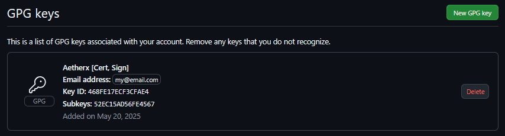
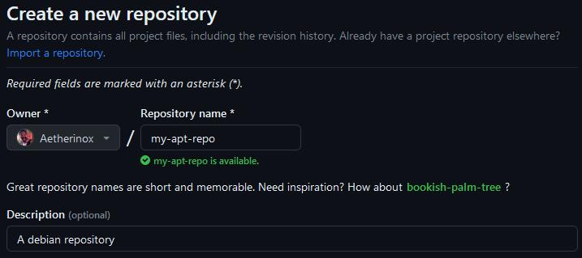

<div align="center">
<h6>Debian / Ubuntu package manager</h6>
<h1>📦 Reprepro 📦</h1>
</div>

**Reprepro** is a tool for managing APT repositories. Reprepro is able to manage multiple repositories for multiple distribution versions and one package pool.

<br />

---

<br />

- [Install](#install)
  - [From Github](#from-github)
  - [From Proteus Apt Repo](#from-proteus-apt-repo)
- [Uninstall](#uninstall)
- [Build](#build)
- [Create Personal Repo](#create-personal-repo)
  - [Step 1: Create GPG Key](#step-1-create-gpg-key)
    - [Certify Key](#certify-key)
    - [Sign Key](#sign-key)
  - [Step 2: Create Github Repo](#step-2-create-github-repo)
  - [Step 3: Publish First Package](#step-3-publish-first-package)
  - [Step 4: Use Your New Repo](#step-4-use-your-new-repo)
- [Commands](#commands)
  - [Add Package](#add-package)
    - [Specific architecture](#specific-architecture)
    - [All architectures](#all-architectures)
    - [Options](#options)
      - [--section](#--section)
      - [--component](#--component)
      - [--architecture](#--architecture)
      - [--priority](#--priority)
      - [--type](#--type)
  - [Check Package Updates](#check-package-updates)
  - [List Packages by Name](#list-packages-by-name)
  - [List Package by Filter](#list-package-by-filter)
  - [List Packages for Specific Codename](#list-packages-for-specific-codename)
  - [List Packages for Specific Section Tag](#list-packages-for-specific-section-tag)
  - [Delete Package by Codename](#delete-package-by-codename)
  - [Delete Package by Filter](#delete-package-by-filter)

<br />

---

<br />

## Install

There are a few ways you can install the latest version of Reprepro:

<br />

### From Github

Run the following command to download the `.deb` package:

```shell
wget https://github.com/Aetherinox/reprepro/releases/download/5.4.7-1-debian/reprepro_5.4.7-1_amd64.deb
```

<br />

Then install the package with:

```shell
sudo dpkg -i reprepro_5.4.7-1_amd64.deb
```

<br />

### From Proteus Apt Repo

We host our own Debian repository that you can download the package from. Open `Terminal` and add the GPG key to your keyring. _(pick one)_:

```shell
# Using curl
curl -fsSL https://github.com/Aetherinox.gpg | \
  sudo gpg --batch --yes --dearmor -o /usr/share/keyrings/aetherinox-proteus-archive.gpg

# Using wget
wget -qO - https://github.com/Aetherinox.gpg | \
  sudo gpg --batch --yes --dearmor -o /usr/share/keyrings/aetherinox-proteus-archive.gpg
```

<br />

Fetch the repo package list with one of the following commands. The command **with variables** will download the package based on your current machine architecture and debian distro. The command without variables allows you to specify which package you can download. _(pick one)_:

```shell
# Using variables
echo "deb [arch=$(dpkg --print-architecture) signed-by=/usr/share/keyrings/aetherinox-proteus-archive.gpg] https://raw.githubusercontent.com/Aetherinox/proteus-apt-repo/main $(lsb_release -cs) main" | \
  sudo tee /etc/apt/sources.list.d/aetherinox-proteus-archive.list

# Without variables
echo "deb [arch=amd64 signed-by=/usr/share/keyrings/aetherinox-proteus-archive.gpg] https://raw.githubusercontent.com/Aetherinox/proteus-apt-repo/main focal main" | \
  sudo tee /etc/apt/sources.list.d/aetherinox-proteus-archive.list
```

<br />

> [!note]
> **Optional** Verify Package
>
> If you want to verify that you downloaded the correct package, run the following command in terminal:
> 
> ```shell
> gpg -n -q --import --import-options import-show \
>     /usr/share/keyrings/aetherinox-proteus-archive.gpg | \
>     awk -v val=$GPG_KEY_FINGERPRINT '/pub/{getline; gsub(/^ +| +$/,"");
>     if($0 == val)
>         print "("$0") Found match for Proteus Apt Repo."
>     else
>         print "("$0") No match for Proteus Apt Repo."}'
> ```
>
> You should see the following output:
> ```shell
> (BCA07641EE3FCD7BC5585281488D518ABD3DC629) Found match for Proteus Apt Repo.
> ```
> 

<br />

You can now install Reprepro and Lintian with the following commands:

```shell
sudo apt update
sudo apt install reprepro
```

<br />

You can confirm Reprepro is installed by running the command:

```shell
$ reprepro --version
reprepro: This is reprepro version 5.4.7
```

<br />

---

<br />

## Uninstall

To remove Reprepro from your Linux system; run:

```shell
sudo apt-get remove reprepro
sudo apt-get purge --auto-remove reprepro
sudo apt-get clean
```


<br />

---

<br />

## Build

To build the Reprepro package; open your `/etc/apt/sources.list` and uncomment any line containing `deb-src` at the beginning.

```console
deb http://us.archive.ubuntu.com/ubuntu/ jammy main restricted
deb-src http://us.archive.ubuntu.com/ubuntu/ jammy main restricted

deb http://us.archive.ubuntu.com/ubuntu/ jammy-updates main restricted
deb-src http://us.archive.ubuntu.com/ubuntu/ jammy-updates main restricted

[...]
```

<br />

Save the file and then update your machine's package sources by running the command:

```shell
apt update
```

<br />

Install dev tools

```shell
apt install build-essential fakeroot devscripts git zstd
```

<br />

Clone the latest code

```shell
mkdir reprepro && cd reprepro
git clone --depth=1 -b reprepro-debian-5.4.7-1 https://github.com/Aetherinox/reprepro.git .
```

<br />

Install build dependencies for reprepro

```shell
apt build-dep .
```

<br />


Now build Reprepro

```shell
debuild -b -uc -us 
```

<br />

Once built, the `.deb` packages will be one folder back; navigate by typing:

```shell
cd ..
```

<br />

You can now install the package with one of two commands:

```shell
# Option 1
sudo apt install reprepro_5.4.7-1_amd64.deb

# Option 2
sudo dpkg -i reprepro_5.4.7-1_amd64.deb
```

<br />

If you need to transfer the `.deb` package to another machine; you have a few options such as:

1. Use [transfer.sh](https://github.com/dutchcoders/transfer.sh)
2. Upload to personal apt repository

<br />

For [transfer.sh](https://github.com/dutchcoders/transfer.sh), run the command:

```shell
curl \
  --upload-file reprepro_5.4.7-1_amd64.deb \
  https://transfer.domain.lan/reprepro_5.4.7-1_amd64.deb
```

<br />

For using a personal apt repository, you will need to set this up yourself. You can use either an nginx / apache2 webserver; or you can host your Linux / debian packages on Github and then add that Github repo to your Linux machine's trusted sources list at `/etc/apt/sources.list`.

<br />

---

<br />

## Create Personal Repo

This section explains how you can use Reprepro + Github to create your own Linux package repository.

<br />

### Step 1: Create GPG Key

Before we can create our new Github repository; you will need to generate a GPG key. This key is what you will use to sign your packages with. If your repository and packages are not signed, Linux will throw a fit.

<br />

There are four subkeys that make up an entire GPG pair, each type is listed below:

- `[C]ertify`
- `[S]ign`
- `[A]uthenticate`
- `[E]ncrypt`

<br />

The only key types we need for this to work is a `[C]ertify` and `[S]ign` subkey. You can generate all four if you want, but `C` and `S` are the only required keys needed.

<br />

If you haven't installed GPG, run the command:

```shell
sudo apt update
sudo apt install gpg
```

<br />
<br />

#### Certify Key

First, create our `[C]` key with the command:

```shell
gpg --expert --full-generate-key
```

<br />

When the text appears, select the following:

- `(8)` **RSA (set your own capabilities)**
  - `(E)` Toggle the encrypt capability
  - `(S)` Toggle the sign capability
  - `(Q)` Finished

<br />

When asked questions, use the following:

<br />

> [!note]
> When asked for your **email address**; it is highly recommended that you set the email address to the same email used for your Github account. Otherwise your GPG key will not be verified.

<br />

- Key Size: `4096`
- Expires: `0`
- Real name: `Your Name`
- Email: `your@email.com` (_see note above_)
- Comment: `RSA 4096`

<br />

You will then be asked to confirm your information:

```shell
You selected this USER-ID:
    "Aetherinox (RSA 4096) <my@email.com>"
     
Change (N)ame, (C)omment, (E)mail or (O)kay/(Q)uit? o
```

<br />

Press `O` for Okay. You will be prompted for a password / passphrase either via a dialog box or in the console window. Create a strong passphrase and press OK. GPG will request you to move your mouse:

```
We need to generate a lot of random bytes. It is a good idea to perform
some other action (type on the keyboard, move the mouse, utilize the
disks) during the prime generation; this gives the random number
generator a better chance to gain enough entropy.
```

<br />

Simply move your mouse, open/close windows. Do as many actions on your device as you can while it generates to help with entropy.

<br />

The system will output a path to your revocation certificate. Save this file somewhere. GPG will display your generated key, as you can see in the output; you will now have the `[C]ertify` key:

```properties
pub   rsa4096 2025-06-05 [C]
      1AEC46BD3EC15FCA34C2F2C2468FE17ECF3CFAE4
uid                      Aetherinox (RSA 4096) <my@email.com>
```

<br />
<br />

#### Sign Key

<br />

You now need to create your `[S]ign` key, copy the GPG key you were given for your `[C]ertify` key and run the command:

```shell
gpg --expert --edit-key 1AEC46BD3EC15FCA34C2F2C2468FE17ECF3CFAE4
```

<br />

It will ask you to type a command for what you want to do, type 

```shell
addkey
```

<br />

Since you already know the process, we'll quickly outline the options to select:

- `(4)` **RSA (sign only)**
  - Key Size: `4096`
  - Expires: `0`

<br />

Confirm your changes. You will be prompted to enter the passphrase you selected when you made the `MASTER / [C]ertify` key in the steps above. Enter that passphrase. Move your mouse around to generate entropy.

<br />

We now have a master key`[C]ertify`, and one sub key `[S]ign`

```console
sec  rsa4096/468FE17ECF3CFAE4
     created: 2025-06-05  expires: never       usage: C
     trust: ultimate      validity: ultimate

ssb  rsa4096/52EC15AD56FE4567
     created: 2025-06-05  expires: never       usage: S

[ultimate] (1). Aetherinox (RSA 4096) <my@email.com>
```

<br />

Since we have our `[C]ertify` and `[S]ign` key, this is as far as we need to go. If you want to generate an `[A]uthenticate` and `[E]ncrypt` subkey, you can. We are not going to give the instructions for that. Next, we will export our keys:

<br />

List your current keys:

```shell
gpg --list-secret-keys --keyid-format=short
```

<br />

You should see a list of your keys:

```console
sec   rsa4096/CF3CFAE4 2025-06-05 [C]
      1AEC46BD3EC15FCA34C2F2C2468FE17ECF3CFAE4
uid         [ultimate] Aetherinox (RSA 4096) <my@email.com>
ssb   rsa4096/56FE4567 2025-06-05 [S]
```

<br />

In the list above, copy the `[C]ertify` keys 8 digit ID:
- `CF3CFAE4`

<br />

You need to create a new group of folders to save your keys in; run the command:

```shell
sudo mkdir -p ./keys/{public,private}
```

Now run the commands to export your **Public GPG Key**:

```shell
gpg --output "keys/public/username.pub.gpg" --export CF3CFAE4
gpg --output "keys/public/username.pub.asc" --export --armor CF3CFAE4
```

<br />

Now run the following commands to export your **Private GPG Keys**. When you export these, you will be asked to provide the **passphrase** you set up earlier when you generated your keys:

```shell
gpg --output "keys/private/username.priv.gpg" --export-secret-key CF3CFAE4
gpg --output "keys/private/username.priv.asc" --armor --export-secret-key CF3CFAE4
```

<br />

After running the commands above, you should have four (4) new files:

- `keys/public/username.pub.gpg`
- `keys/public/username.pub.asc`
- `keys/private/username.priv.gpg`
- `keys/private/username.priv.asc`

<br />

The files ending with `gpg` are binary copies of your public and private key. The files ending with `asc` are armored copies of your public and private key. The `.gpg` and `.asc` files are the same keys, just in different formats. Your repository will use the `.asc armored` keys.

<br />

If you need to import your GPG keys onto another system, you can transfer the keys and then use the command:

```shell
gpg --import keys/private/username.priv.asc
```

<br />

Now is a good time to add these newly generated keys to your [Github account](https://github.com). Sign into Github and go to the page: 
- https://github.com/settings/keys

<br />

<p align="center"></p>

<br />

After you have completed all of this, proceed to the next step [Step 2: Create Github Repo](#step-2-create-github-repo)

<br />
<br />

### Step 2: Create Github Repo

<br />

Next, sign into your Github account and create a new repository.

<p align="center"></p>

<br />

Now visit your new repository, you may want to clone this new repository to your system so that you can create the required folders and commit.

<br />

```shell
mkdir -p github/my-apt-repo
cd github/my-apt-repo
git clone https://github.com/username/my-apt-repo.git .
```

<br />

Create a new folder for your project: 
- `github/my-apt-repo/conf`
- `github/my-apt-repo/incoming`
- `github/my-apt-repo/db`
- `github/my-apt-repo/dists`
- `github/my-apt-repo/pool`
- `github/my-apt-repo/logs`

```shell
mkdir -p github/my-apt-repo/{conf,incoming,db,dists,pool,logs}
```

<br />

Create a new file in `github/my-apt-repo/conf/distributions`. You can use the command below, or create it in notepad:

```shell
# Create the distributions file
cat <<EOF > github/my-apt-repo/conf/distributions
    Origin: Aetherinox
    Label: Noble 24.04
    Suite: stable
    Codename: noble
    architectures: amd64 arm64 i386 source
    Components: main
    Description: Ubuntu 24.04 (Noble) LTS
    SignWith: CF3CFAE4
    Log: logs/noble.log
    Update: noble
    Limit: 0
EOF
```

<br />

> [!note]
> The **SignWith** property specifies the GPG key you will use to sign your repository with.
>
> You should have your GPG keys already generated if you followed the instructions in the previous section:
>   - [Step 1: Create GPG Key](#step-1-create-gpg-key)
> 

<br />

If you don't want to use the Linux `cat` command above, you can paste the following inside `github/my-apt-repo/conf/distributions`.  The below file is an example of how it is set up. We will add **Ubuntu Noble**:

```ini
Origin: Aetherinox
Label: Noble Numbat 24.04 LTS
Suite: stable
Codename: noble
architectures: amd64 arm64 i386 source
Components: main
Description: Ubuntu 24.04 (Noble Numbat)
SignWith: CF3CFAE4
Log: logs/noble.log
Update: noble
Limit: 0
```

<br />

To add more than one, simply add a blank line and start again:

```ini
Origin: Aetherinox
Label: Noble Numbat 24.04 LTS
Suite: stable
Codename: noble
architectures: amd64 arm64 i386 source
Components: main
Description: Ubuntu 24.04 (Noble Numbat)
SignWith: CF3CFAE4
Log: logs/noble.log
Update: noble
Limit: 0

Origin: Aetherinox
Label: Jammy Jellyfish 22.04 LTS
Suite: stable
Codename: jammy
architectures: amd64 arm64 i386 source
Components: main
Description: Ubuntu 22.04 (Jammy Jellyfish)
SignWith: CF3CFAE4
Log: logs/jammy.log
Update: jammy
Limit: 0
```

<br />

> [!note]
> The **Limit** property allows you to define how many versions of the package will be stored in your Debian repo at a time. Set this to `0` for **unlimited**. If you only want the latest version of each package, and to NOT save older versions, set `Limit: 1`
>
> If you set `Limit: 1`, then every time a new version of a package is added, all older copies will be deleted and cleaned from your repo.

<br />

Next, create `conf/updates` and add the following:

```ini
Name: focal
Method: http://ports.ubuntu.com/ubuntu-ports/
Suite: focal
architectures: source i386 amd64 arm64
Components: main
UDebComponents:
VerifyRelease: blindtrust
# VerifyRelease: CF3CFAE4|CF3CFAE4

Name: jammy
Method: http://ports.ubuntu.com/ubuntu-ports/
Suite: jammy
architectures: source i386 amd64 arm64
Components: main
UDebComponents:
VerifyRelease: blindtrust
# VerifyRelease: CF3CFAE4|CF3CFAE4

Name: lunar
Method: http://ports.ubuntu.com/ubuntu-ports/
Suite: lunar
architectures: source i386 amd64 arm64
Components: main
UDebComponents:
VerifyRelease: blindtrust

Name: mantic
Method: http://ports.ubuntu.com/ubuntu-ports/
Suite: mantic
architectures: source i386 amd64 arm64
Components: main
UDebComponents:
VerifyRelease: blindtrust

Name: noble
Method: http://ports.ubuntu.com/ubuntu-ports/
Suite: noble
architectures: source i386 amd64 arm64
Components: main
UDebComponents:
VerifyRelease: blindtrust
#VerifyRelease: 3F272F5B|437D05B5|8D8AEBF1|3B4FE6ACC0B21F32|871920D1991BC93C
```

<br />

The `conf/updates` file will allow you to run `reprepro checkupdate noble`

<br />

Once you finish the above instructions, you are ready to add your first package. If you did all of the above by cloning your new debian repo, make sure to commit your changes first:

```shell
git add .
git commit -m "chore: initialize debian repo"
git push
```

<br />
<br />

### Step 3: Publish First Package

To add our first package, you need to first find a `.deb` package you want to add to your new debian repo. For this example, we'll download and add Reprepro. Make sure you are in the root folder of your new debian repository; you should see:

```console
📁 github
   📁 my-apt-repo
      📁 conf
      📁 incoming
      📁 db
      📁 dists
      📁 pool
      📁 logs
```

<br />

`cd` into the root folder:

```shell
cd github/my-apt-repo
```

<br />

Now download a test `.deb` package such as Reprepro:

```shell
wget https://github.com/Aetherinox/reprepro/releases/download/5.4.7-1-debian/reprepro_5.4.7-1_amd64.deb
```

<br />

We will add Reprepro to our debian repository, and mark the package as being for the `amd64` architecture, and for Ubuntu distro `noble`. Run the command below; edit it to fit your needs.

<br />

For the architecture, you have the following options:
- `amd64`
- `arm64`
- `i386`
- `all`

<br />

For `all`, skip the command below and use the next one:

<br />

```shell
# add package to amd64

reprepro -V \
    --section utils \
    --component main \
    --priority 0 \
    --architecture amd64 \
    includedeb noble "reprepro_5.4.7-1_amd64.deb"
```

<br />

Once you complete the command, you should see:

```shell
Exporting indices...
Successfully created './dists/noble/Release.gpg.new'
Successfully created './dists/noble/InRelease.new'
```

<br />

If you have a package which you want to add to `all` and is not limited to any one specific aritecture, the command will look slightly different. We will remove the `--architecture` option we used above. This will specify that the package is for any architecture:

```shell
reprepro -V \
    --section utils \
    --component main \ 
    --priority 0 \
    includedeb noble "reprepro_5.4.7-1_all.deb"
```

<br />

Some debian packages will be labeled with the filename `_all.deb` and some will only be for specific architectures. So pay close attention to what architecture a .deb file is generated for.

<br />

Now that we have added a package, push the new package and changes:

```shell
git add .
git commit -m "chore: add package reprepro_5.4.7-1_amd64.deb"
git push
```

<br />
<br />

### Step 4: Use Your New Repo

Now that we have created our own Debian / Ubuntu repository; we can add it to our own system and download packages from it. To do this, we need to add the GPG key you generated in the section [Step 1: Create GPG Keys ](#step-1-create-gpg-key).

<br />

Github stores our public GPG key when we add it to our Github account, it is accessible by going to the URL below (change the USERNAME to your own):
- https://github.com/Username.gpg

<br />

Once you have your public GPG key, paste the URL in the command below:

<br />

```
curl -fsSL https://github.com/Username.gpg | \
  sudo gpg --batch --yes --dearmor -o /usr/share/keyrings/username-my-apt-repo.gpg
```

<br />

Next, add your new repository to your Linux source list. Make sure to:

- Change `USERNAME` to your own username
- Change `my-apt-repo` to the name of your Github repo
- Change `main` to the branch you are using in the Github repo.
  - Sometimes this is also called `master`

```shell
echo "deb [arch=$(dpkg --print-architecture) signed-by=/usr/share/keyrings/USERNAME-my-apt-repo.gpg] https://raw.githubusercontent.com/USERNAME/my-apt-repo/main $(lsb_release -cs) main" | \
  sudo tee /etc/apt/sources.list.d/USERNAME-my-apt-repo.list
```

<br />

Now update your packages so that the new repo is added:

```shell
sudo apt update
```

<br />

We can actually see where a package is being distributed from by running the command:

```shell
apt-get download --print-uris reprepro
```

<br />

You should see the response which says it's coming from your own Github repository:

```console
'https://raw.githubusercontent.com/USERNAME/my-apt-repo/main/pool/main/r/reprepro/reprepro_5.4.7-1_amd64.deb' reprepro_5.4.7-1_amd64.deb 2310 
SHA512:5d04d99e636b897e39c7b7b834e845cd7bc98ed82e5ebb7657fc035819e05d585ddc3c7a8c6e2c9c3c47e56d4529d7b2b185addceb1c2115b6ea32982d6f6de6
```

<br />

We can now install the latest version of Reprepro from our own Github hosted Debian repository:

```shell
sudo apt install reprepro
```

<br />

This concludes the basics of getting a Github hosted Debian / Ubuntu repository started.

<br />

---

<br />

## Commands

This is a list of the most needed commands.

<br />

### Add Package

There are two ways you can add a package:
1. For all architecture
2. For specific architecture

<br />

#### Specific architecture

To add a new package to your repository database for a specific architecture. Change `amd64` to any of the following:

- `amd64`
- `arm64`
- `i386`

<br />

The list of available architectures is located in `/my-apt-repo/conf/distributions`

```shell
reprepro -V \
    --section utils \
    --component main \
    --priority 0 \
    --architecture amd64 \
    includedeb noble packagename_1.0.0_amd64.deb
```

<br />
<br />

#### All architectures

Adds a new package to your repository database for the architecture `all` .

```shell
reprepro -V \
    --section utils \
    --component main \
    --priority 0 \
    includedeb noble packagename_1.0.0_amd64.deb
```

<br />

#### Options

When adding a new package to your Reprepro repository, there are numerous options you can specify for the command. This section outlines what those options are:

<br />

##### --section

The following is a list of available `sections`:

| Section ID       | Desc |
| ---------------- | ---------------------------------------------------------------------------------------------------------------------------------------------- |
| admin            | Utilities to administer system resources, manage user accounts, etc.                                                                           |
| cli-mono         | Everything about Mono and the Common Language Infrastructure.                                                                                  |
| comm             | Software to use your modem in the old fashioned style.                                                                                         |
| database         | Database Servers and Clients.                                                                                                                  |
| debian-installer | Special packages for building customized debian-installer variants. Do not install them on a normal system!                                    |
| debug            | Packages providing debugging information for executables and shared libraries.                                                                 |
| devel            | Development utilities, compilers, development environments, libraries, etc.                                                                    |
| doc              | FAQs, HOWTOs and other documents trying to explain everything related to Debian, and software needed to browse documentation (man, info, etc). |
| editors          | Software to edit files. Programming environments.                                                                                              |
| education        | Software for learning and teaching.                                                                                                            |
| electronics      | Electronics utilities.                                                                                                                         |
| embedded         | Software suitable for use in embedded applications.                                                                                            |
| fonts            | Font packages.                                                                                                                                 |
| games            | Programs to spend a nice time with after all this setting up.                                                                                  |
| gnome            | The GNOME desktop environment, a powerful, easy to use set of integrated applications.                                                         |
| gnu-r            | Everything about GNU R, a statistical computation and graphics system.                                                                         |
| gnustep          | The GNUstep environment.                                                                                                                       |
| golang           | Go programming language, libraries, and development tools.                                                                                     |
| graphics         | Editors, viewers, converters... Everything to become an artist.                                                                                |
| hamradio         | Software for ham radio.                                                                                                                        |
| haskell          | Everything about Haskell.                                                                                                                      |
| httpd            | Web servers and their modules.                                                                                                                 |
| interpreters     | All kind of interpreters for interpreted languages. Macro processors.                                                                          |
| introspection    | Machine readable introspection data for use by development tools.                                                                              |
| java             | Everything about Java.                                                                                                                         |
| javascript       | JavaScript programming language, libraries, and development tools.                                                                             |
| kde              | The K Desktop Environment, a powerful, easy to use set of integrated applications.                                                             |
| kernel           | Operating System Kernels and related modules.                                                                                                  |
| libdevel         | Libraries necessary for developers to write programs that use them.                                                                            |
| libs             | Libraries to make other programs work. They provide special features to developers.                                                            |
| lisp             | Everything about Lisp.                                                                                                                         |
| localization     | Localization support for big software packages.                                                                                                |
| mail             | Programs to route, read, and compose E-mail messages.                                                                                          |
| math             | Math software.                                                                                                                                 |
| metapackages     | Packages that mainly provide dependencies on other packages.                                                                                   |
| misc             | Miscellaneous utilities that didn't fit well anywhere else.                                                                                    |
| net              | Daemons and clients to connect your system to the world.                                                                                       |
| news             | Software to access Usenet, to set up news servers, etc.                                                                                        |
| ocaml            | Everything about OCaml, an ML language implementation.                                                                                         |
| oldlibs          | Old versions of libraries, kept for backward compatibility with old applications.                                                              |
| otherosfs        | Software to run programs compiled for other operating systems, and to use their filesystems.                                                   |
| perl             | Everything about Perl, an interpreted scripting language.                                                                                      |
| php              | Everything about PHP.                                                                                                                          |
| python           | Everything about Python, an interpreted, interactive object oriented language.                                                                 |
| ruby             | Everything about Ruby, an interpreted object oriented language.                                                                                |
| rust             | Rust programming language and development tools.                                                                                               |
| science          | Basic tools for scientific work.                                                                                                               |
| shells           | Command shells. Friendly user interfaces.                                                                                                      |
| sound            | Utilities to deal with sound: mixers, players, recorders, CD players, etc.                                                                     |
| tasks            | Packages that are used by 'tasksel', a simple interface for users who want to configure their system to perform a specific task.               |
| tex              | The famous typesetting software and related programs.                                                                                          |
| text             | Utilities to format and print text documents.                                                                                                  |
| utils            | Utilities for file/disk manipulation, backup and archive tools, system monitoring, input systems, etc.                                         |
| vcs              | Version control systems and related utilities.                                                                                                 |
| video            | Video viewers, editors, recording, streaming.                                                                                                  |
| virtual          | Virtual packages.                                                                                                                              |
| web              | Web servers, browsers, proxies, download tools etc.                                                                                            |
| x11              | X servers, libraries, window managers, terminal emulators and many related applications.                                                       |
| xfce             | Xfce, a fast and lightweight Desktop Environment.                                                                                              |
| zope             | Zope Application Server and Plone Content Managment System.                                                                                                                                               |

<br />

##### --component

Defining `--component` allows you to add, list or delete only for a specific component.

When adding a new `.deb` package to your apt repo, one of the options in the command will be `component`, these are the options you have to pick from:

| Component | Description |
| --------- | ----------- |
| `main`    | Canonical-supported free and open-source software.|
| `universe`    | Community-maintained free and open-source software.|
| `restricted`    | Proprietary drivers for devices.|
| `multiverse`    | Software restricted by copyright or legal issues.|

<br />

To define what **Components** are available for you to use, edit the reprepro file:

- `/my-apt-repo/conf/distributions`

<br />

Once the file is opened, you will see the `Components` field:

```ini
Components: main
```

<br />

##### --architecture

Defining `--architecture` allows you to add, list or delete only for a specific architecture.

Depending on context and the control file used, the architecture field can include the following sets of values:

| Arch             | Desc                                           |
| ---------------- | ---------------------------------------------- |
| `all`            | Indicates architecture-independent package.    |
| `source`         | Indicates source package.                      |
| `alpha`          | Alpha AXP 64-bit reduced instruction set computer (RISC) instruction set architecture (ISA) developed by Digital Equipment Corporation |
| `amd64`          | Also known as em64t or x86-64                  |
| `arc`            | Argonaut RISC Core                             |
| `arm`            | NetWinder, NSLU2, ...                          |
| `arm64`          | Arm v8 64-bit systems                          |
| `armel`          | QNAP, ?SheevaPlug, Raspberry Pi 1              |
| `armhf`          | Arm v7 32-bit systems; for kernel support see ?DebianKernel/ARMMP |
| `avr32`          | 32-bit RISC microcontroller architecture produced by Atmel |
| `hppa`           | HP Precision Architecture                      |
| `hurd-i386`      | 32-bit x86 architecture; IBM, HP, Dell         |
| `i386`           | Original x86 platform. Now requires "686" class CPU. |
| `ia64`           | Itanium (not Intel Core series)                |
| `kfreebsd-amd64` | FreeBSD port to AMD’s AMD64 (Hammer) and Intel® (Yamhill) 64 architecture |
| `kfreebsd-i386`  | Intel Pentium Pro / Pentium II (i686) or better |
| `m68k`           | Amiga, !AtariST, very old Macintoshes, some old Sun hardware (sun3) |
| `mips`           | Big-endian 32-bit                              |
| `mips64el`       | Little-endian 64-bit (Playstation 2)           |
| `mipsel`         | Little-endian 32-bit (Playstation 1)           |
| `powerpc`        | Old Macintoshes                                |
| `powerpcspe`     | IBM "e500" cores                               |
| `ppc64`          | Old Macintoshes, IBM POWER systems             |
| `ppc64el`        | POWER8, POWER9 systems                         |
| `riscv64`        | Debian port for 64-bit little-endian RISC-V    |
| `s390`           | BigIron - IBM mainframe platform               |
| `s390x`          | Newer BigIron - IBM mainframe platform         |
| `sh4`            | RISC processor by Hitachi; part of SuperH family. Main CPU in Sega Dreamcast console and NAOMI, NAOMI 2 and Hikaru arcade platforms. |
| `sparc`          | Scalable Processor ARChitecture; 32-bit microprocessor by Sun Microsystems in 1987 |
| `sparc64`        | Scalable Processor ARChitecture; 64-bit microprocessor by Sun Microsystems in 1987 |
| `x32`            | 32-bit ABI using x86-64 (amd64) ISA.           |

<br />

To define what architectures are available for you to use, edit your reprepro file:

- `/my-apt-repo/conf/distributions`

<br />

Once the file is opened, you will see the `architectures` field:

```ini
architectures: amd64 arm64 i386 source
```

<br />

##### --priority

Each package must have a priority value, which is set in the metadata for the Debian archive and is also included in the package’s control files. This information is used to control which packages are included in standard or minimal Debian installations.

<br />

Most Debian packages will have a priority of `optional`. Priority levels other than optional are only used for packages that should be included by default in a standard installation of Debian.

<br />

The priority of a package is determined solely by the functionality it provides directly to the user. The priority of a package should not be increased merely because another higher-priority package depends on it; instead, the tools used to construct Debian installations will correctly handle package dependencies. In particular, this means that C-like libraries will almost never have a priority above optional, since they do not provide functionality directly to users. However, as an exception, the maintainers of Debian installers may request an increase of the priority of a package to resolve installation issues and ensure that the correct set of packages is included in a standard or minimal install.

<br />

The following priority levels are recognized by the Debian package management tools.

| Priority | Description |
| --- | --- |
| `required` | Packages which are necessary for the proper functioning of the system (usually, this means that dpkg functionality depends on these packages). Removing a `required` package may cause your system to become totally broken and you may not even be able to use `dpkg` to put things back, so only do so if you know what you are doing.<br /><br />Systems with only the `required` packages installed have at least enough functionality for the sysadmin to boot the system and install more software. |
| `important` | Important programs, including those which one would expect to find on any Unix-like system. If the expectation is that an experienced Unix person who found it missing would say “What on earth is going on, where is `foo`?”, it must be an `important` package. Other packages without which the system will not run well or be usable must also have priority `important`. This does not include Emacs, the X Window System, TeX or any other large applications. The `important` packages are just a bare minimum of commonly-expected and necessary tools. | 
| `standard` | These packages provide a reasonably small but not too limited character-mode system. This is what will be installed by default if the user doesn’t select anything else. It doesn’t include many large applications. <br /><br /> Two packages that both have a priority of `standard` or higher must not conflict with each other. |
| `optional` | This is the default priority for the majority of the archive. Unless a package should be installed by default on standard Debian systems, it should have a priority of `optional`. Packages with a priority of `optional` may conflict with each other. |
| `extra` | _This priority is deprecated._ Use the `optional` priority instead. <br /><br />This priority should be treated as equivalent to `optional`.<br /><br />The `extra` priority was previously used for packages that conflicted with other packages and packages that were only likely to be useful to people with specialized requirements. However, this distinction was somewhat arbitrary, not consistently followed, and not useful enough to warrant the maintenance effort. |

<br />

The `priority` is defined when you add a package with the command:

```shell
reprepro -V \
    --section utils \
    --component main \
    --priority optional \
    --architecture amd64 \
    includedeb noble "reprepro_5.4.7-1_amd64.deb"
```

<br />

##### --type

Limits the specified command to this package type only. (i.e. only list such packages, only remove such packages, only include such packages, ...). You can define the type when adding a new package:

```shell
reprepro -V \
    --section utils \
    --component main \
    --priority optional \
    --architecture amd64 \
    --type deb \
    includedeb noble "reprepro_5.4.7-1_amd64.deb"
```

<br />

**Available options:**
- dsc
- deb
- udeb
- ddeb

<br />
<br />

### Check Package Updates

This allows you to check existing packages for updates against the Ubuntu repositories by running:

```shell
reprepro checkupdate noble
```

<br />
<br />

### List Packages by Name

Lists all packages with a specific name; no matter what distro or architecture they are for.

```shell
reprepro ls opengist
```

<br />

Response:

```console
opengist | 1.10.0 | focal | amd64, arm64, i386
opengist | 1.10.0 | jammy | amd64, arm64, i386
opengist |  1.7.3 | noble | amd64, arm64
```

<br />
<br />

### List Package by Filter

Lists a package depending on the filters used. The following will list any packages for codename `lunar` with the section `utils`:

```shell
sudo reprepro -b . listfilter lunar 'Section (== utils)'
```

<br />

To list all packages under the architecture `all` for codename `lunar`:

```shell
sudo reprepro -b . listfilter lunar 'architecture (== all)'
```

<br />

To list all packages ending with `.deb` extension for codename `lunar`:

```shell
sudo reprepro -b . listfilter lunar '$PackageType (==deb)'
```

<br />
<br />

### List Packages for Specific Codename

Lists all of the added packages for a specific codename such as `noble` and `jammy`. The codenames available to use are specified in `/my-apt-repo/conf/distributions`

```shell
reprepro list noble
```

<br />

Response:

```console
noble|main|amd64: adduser 3.137ubuntu1
noble|main|arm64: adduser 3.137ubuntu1
noble|main|i386: adduser 3.137ubuntu1
```

<br />
<br />

### List Packages for Specific Section Tag

Lists all of the added packages that are flagged under a different **section** name.

```shell
sudo reprepro -b . listfilter noble 'Section (== utils)'
```

<br />
<br />

### Delete Package by Codename

Deletes a package for a specific codename:

```shell
reprepro remove mantic google-chrome-stable
reprepro remove lunar google-chrome-stable
reprepro remove jammy google-chrome-stable
reprepro remove focal google-chrome-stable

reprepro deleteunreferenced
reprepro dumpunreferenced
```

<br />
<br />

### Delete Package by Filter

Deletes a package that meets a specific filter rule. The following deletes all packages under codename `lunar` that have the file extension `.deb`:

```shell
sudo reprepro -b . removefilter lunar '$PackageType (==deb)'
```

<br />

To delete any packages for codename `lunar` with the section `utils`:

```shell
sudo reprepro -b . listfilter lunar 'Section (== utils)'
```

<br />

You can then remove the references:

```shell
sudo reprepro deleteunreferenced
sudo reprepro clearvanished
sudo reprepro dumpunreferenced
```